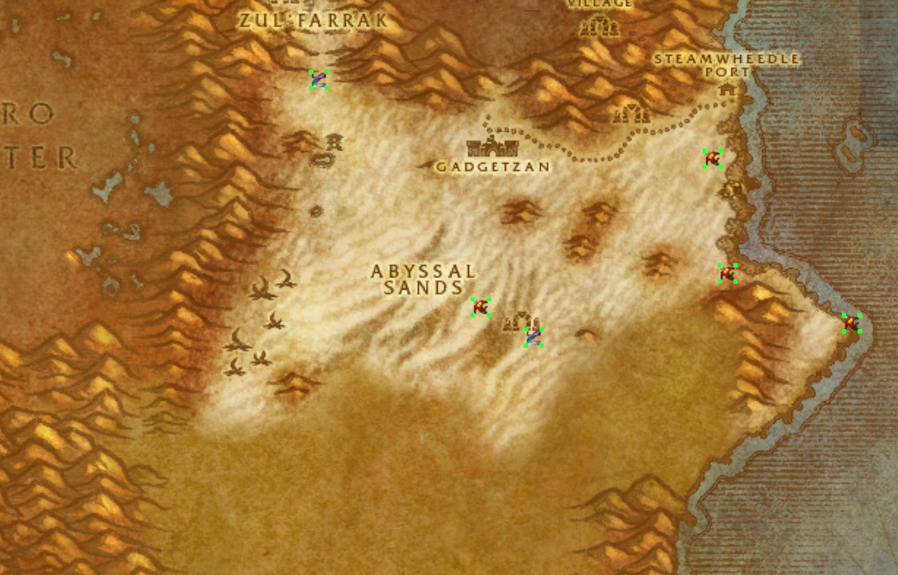
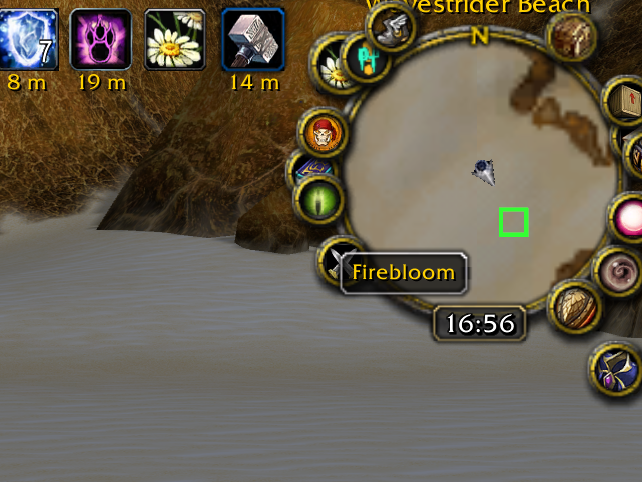
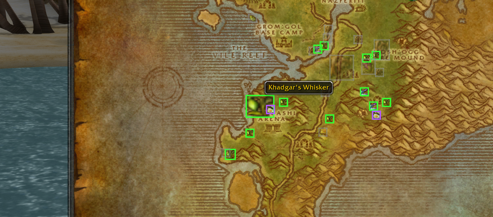
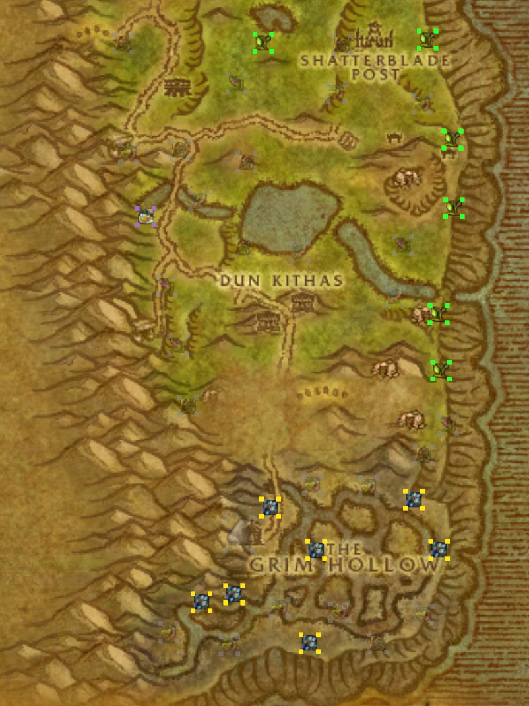

# Octo Gather

Octo Gather is a self-learning resource map overlay for OctoWoW and Vanilla
WoW 1.12. It remembers successfully gathered herbs and minerals, skinning
results, lockpicking practice chests, and ordinary treasure chests. Saved
locations appear as difficulty-colored outlines on the minimap and as resource
icons with colored outlines on the world map.

Locations are saved account-wide in `OctoGatherDB`, so every character can use
the same database and the locations remain available after logout or `/reload`.

## How it works

- Successfully gather, mine, skin, or open a chest to teach Octo Gather the
  resource and position.
- Normal interaction and the
  [Interact](https://github.com/lookino/Interact) hotkey are supported.
- Each location records its main map zone and the smaller minimap subzone name.
- Marker colors are recalculated from the current character's Herbalism,
  Mining, Skinning, or Lockpicking skill. Ordinary treasure chests compare
  their chest tier with character level.
- Custom resources can learn their requirement when the tooltip includes a
  `Requires Herbalism (N)`, `Requires Mining (N)`, or similar line.

## Supported resources

- **Herbalism:** saves the herb node and compares it with Herbalism.
- **Mining:** saves ore veins and deposits and compares them with Mining.
- **Skinning:** saves the leather, hide, scale, or other item actually obtained
  and compares the skinned creature's requirement with Skinning. These markers
  are hunting spots rather than exact spawn points because creatures move.
- **Lockpicking:** saves world chests that expose a Lockpicking requirement and
  compares them with the rogue's Lockpicking skill. These markers are only
  displayed while playing a rogue.
- **Treasure chests:** saves ordinary open-world chests. Known Vanilla chest
  tiers compare with character level; unknown custom tiers appear purple.

## Map markers

### Minimap

The minimap displays an empty colored outline at every saved location currently
in range. Move the mouse over an outline to see the resource name beside the
cursor.

### World map

The selected zone's world map displays the resource icon inside
each colored outline. Move the mouse over a marker to see its resource name. Use the
**Octo Gather** checkbox in the upper-left corner of the world map to show or
hide the overlay; the setting is saved account-wide.

Nearby markers for the same resource merge into a larger rectangular marker
when their outlines overlap. Different resources remain separate and may
overlap, preventing unrelated locations from merging into oversized frames.

## Difficulty colors

For professions, the outline compares the saved requirement with your current
skill:

| Color | Meaning |
| --- | --- |
| Red | You cannot gather it yet |
| Orange | Current skill through 24 points above the requirement |
| Yellow | 25-49 points above the requirement |
| Green | 50-99 points above the requirement |
| Gray | 100 or more points above the requirement |
| Purple | The resource requirement or chest tier is not known |

Ordinary treasure chests use the same progression idea with character level:
red is well above your level, yellow is around your level, green is below it,
and gray is at least ten levels below it.

Gray markers use 50% opacity on both maps so low-value locations remain visible
without overwhelming the display. All other colors use full opacity.

## Commands

- `/ogather` or `/ogather count` — show counts by resource and current skills.
- `/ogather on` — show minimap markers.
- `/ogather off` — hide minimap markers while continuing to learn locations.

## Installation

1. Extract or copy the `OctoGather` folder into `World of
   Warcraft\Interface\AddOns`.
2. Restart WoW or run `/reload` if the add-on was already installed.
3. Enable **Load out of date AddOns** on the character screen if the client asks
   for it.

No other add-on is required. Interact integration is enabled automatically when
Interact is installed.

## Important limitations

Octo Gather markers represent saved possible spawn locations or, for skinning,
places where a resource was previously obtained. Blizzard's yellow tracking
dot still indicates whether a tracked herb or mineral is currently spawned;
the Vanilla 1.12 API does not reveal the identity of an individual live
tracking dot.

World-map markers appear on a specifically selected zone map, not on the full
continent view. Octo Gather includes minimap dimensions for the OctoWoW/Turtle
WoW 1.18.1 outdoor and event maps: Hyjal, Scarlet Enclave, Lapidis Isle,
Gillijim's Isle, Tel'Abim, Alah'Thalas, Gilneas, Icepoint Rock, Blackstone
Island, Thalassian Highlands, Winter Veil Vale, Grim Reaches, Balor, Northwind,
and Moonwhisper Coast. Custom areas inside an existing Vanilla zone, such as
Tirisfal Uplands, automatically use their parent map's dimensions.

## Credits

- Minimap coordinate scaling and bundled herb artwork are based on the original
  [Gatherer](https://github.com/jsb/Gatherer) project for Vanilla WoW.
- Grim Reaches dimensions use Turtle WoW map data from
  [MetaHunt](https://github.com/DuvelCorp/MetaHunt).
